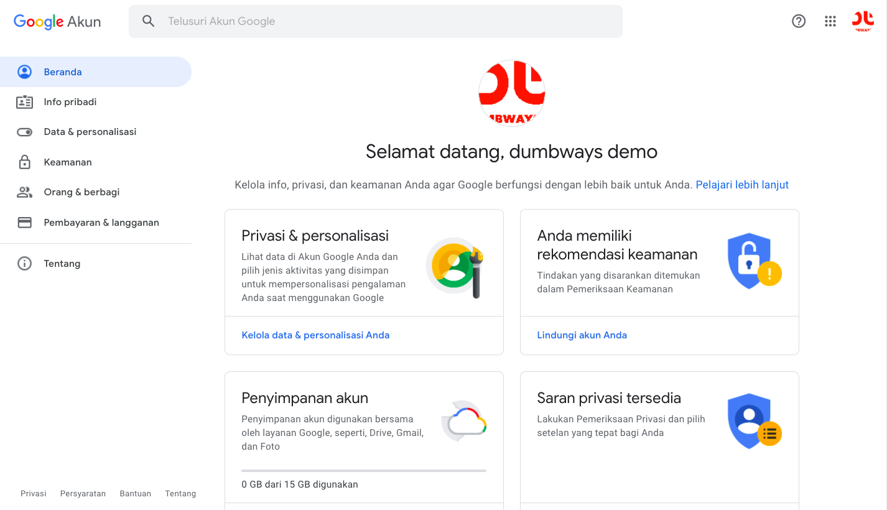
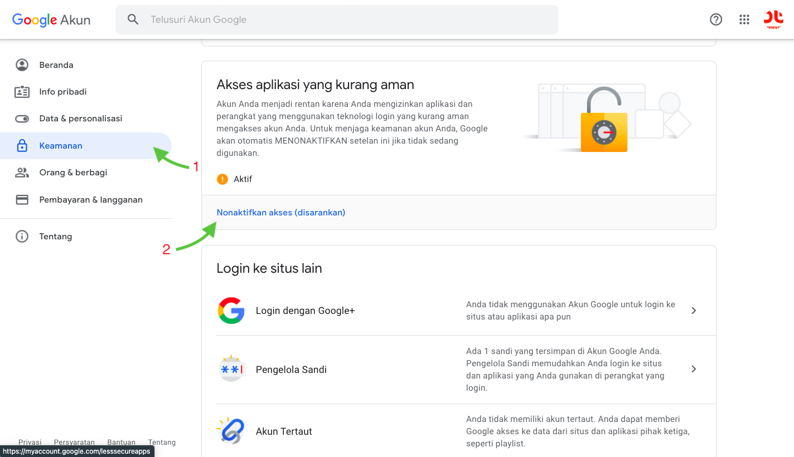

# Nodemailer

`Nodemailer` is a module for Node.js that allows us to easily send emails.

## Prepare

- Install package nodemailer on server side

  ```text
  npm i nodemailer
  ```

* Add email & password to your `.env` file (server side) :

  ```text
  SYSTEM_EMAIL=xxxxxxxxx@gmail.com
  SYSTEM_PASSWORD=xxxxxxxxx
  ```

* If an error occurs when sending an email:

  Error message :

  ```text
  Error: Invalid login: 535-5.7.8 Username and Password not accepted.
  ```

  Handle :

  - Go to google account page

    

  - Click `Keamanan` and `Nonaktifkan akses`

    

  - `Turn on` allow less secure apps

    

## Handle send email on backend

> File : `server/src/controller/transaction.js`

- Import nodemailer :

  ```javascript
  const nodemailer = require("nodemailer");
  ```

* Function for handle send email :

  ```javascript
  const sendEmail = async (status, transactionId) => {
    // Config service and email account
    const transporter = nodemailer.createTransport({
      service: "gmail",
      auth: {
        user: process.env.SYSTEM_EMAIL,
        pass: process.env.SYSTEM_PASSWORD,
      },
    });

    // Get transaction data
    let data = await transaction.findOne({
      where: {
        id: transactionId,
      },
      attributes: {
        exclude: ["createdAt", "updatedAt", "password"],
      },
      include: [
        {
          model: user,
          as: "buyer",
          attributes: {
            exclude: ["createdAt", "updatedAt", "password", "status"],
          },
        },
        {
          model: product,
          as: "product",
          attributes: {
            exclude: [
              "createdAt",
              "updatedAt",
              "idUser",
              "qty",
              "price",
              "desc",
            ],
          },
        },
      ],
    });

    data = JSON.parse(JSON.stringify(data));

    // Email options content
    const mailOptions = {
      from: process.env.SYSTEM_EMAIL,
      to: data.buyer.email,
      subject: "Payment status",
      text: "Your payment is <br />" + status,
      html: `<!DOCTYPE html>
              <html lang="en">
                <head>
                  <meta charset="UTF-8" />
                  <meta http-equiv="X-UA-Compatible" content="IE=edge" />
                  <meta name="viewport" content="width=device-width, initial-scale=1.0" />
                  <title>Document</title>
                  <style>
                    h1 {
                      color: brown;
                    }
                  </style>
                </head>
                <body>
                  <h2>Product payment :</h2>
                  <ul style="list-style-type:none;">
                    <li>Name : ${data.product.name}</li>
                    <li>Total payment: ${convertRupiah.convert(data.price)}</li>
                    <li>Status : <b>${status}</b></li>
                  </ul>  
                </body>
              </html>`,
    };

    // Send an email if there is a change in the transaction status
    if (data.status != status) {
      transporter.sendMail(mailOptions, (err, info) => {
        if (err) throw err;
        console.log("Email sent: " + info.response);

        return res.send({
          status: "Success",
          message: info.response,
        });
      });
    }
  };
  ```

* Add sendEmail function on conditional notification function with two params (`status`,`orderId`)

  ```javascript
  ...
  if (transactionStatus == "capture") {
    if (fraudStatus == "challenge") {
      // TODO set transaction status on your database to 'challenge'
      // and response with 200 OK
      sendEmail("pending", orderId); //sendEmail with status pending and order id
      handleTransaction("pending", orderId);
      res.status(200);
    } else if (fraudStatus == "accept") {
      // TODO set transaction status on your database to 'success'
      // and response with 200 OK
      sendEmail("success", orderId); //sendEmail with status success and order id
      updateProduct(orderId);
      handleTransaction("success", orderId);
      res.status(200);
    }
  } else if (transactionStatus == "settlement") {
    // TODO set transaction status on your database to 'success'
    // and response with 200 OK
    sendEmail("success", orderId); //sendEmail with status success and order id
    updateProduct(orderId);
    handleTransaction("success", orderId);
    res.status(200);
  } else if (
    transactionStatus == "cancel" ||
    transactionStatus == "deny" ||
    transactionStatus == "expire"
  ) {
    // TODO set transaction status on your database to 'failure'
    // and response with 200 OK
    sendEmail("failed", orderId); //sendEmail with status failed and order id
    handleTransaction("failed", orderId);
    res.status(200);
  } else if (transactionStatus == "pending") {
    // TODO set transaction status on your database to 'pending' / waiting payment
    // and response with 200 OK
    sendEmail("pending", orderId); //sendEmail with status pending and order id
    handleTransaction("pending", orderId);
    res.status(200);
  }
  ...
  ```
